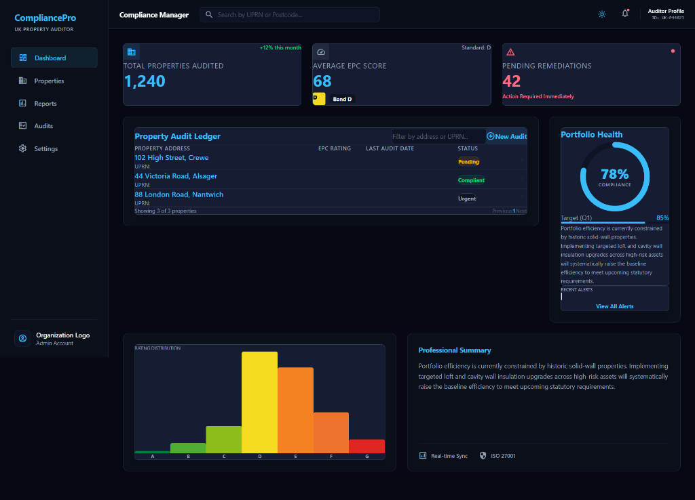
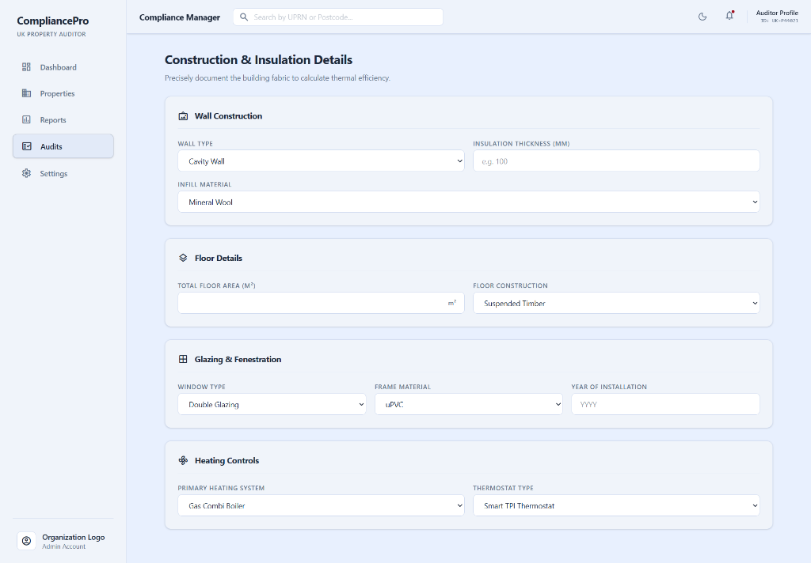
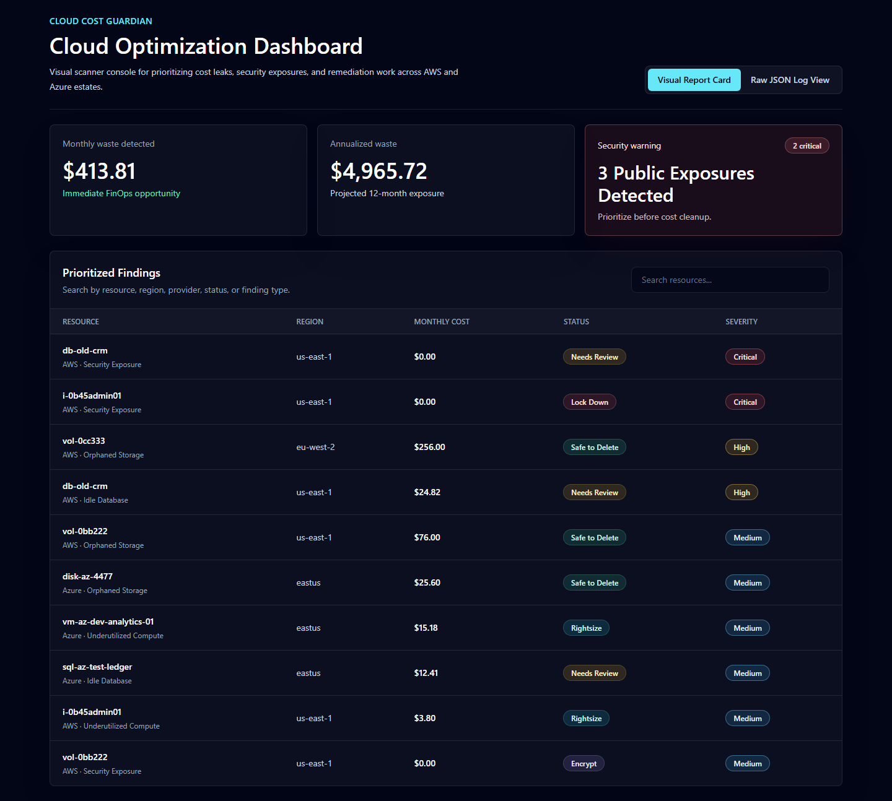
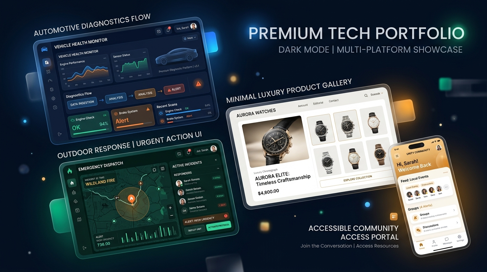

# Hi, I'm Dean (@stokie2605) 🛠️
> Full-stack developer focused on operational web apps, automation tools, cloud workflows, and data pipelines.

---

## 💻 Selected Engineering Projects

### 1. [UK EPC Compliance Auditor](https://github.com/stokie2605/uk-epc-auditor)
A property compliance dashboard exploring EPC/MEES checks, address matching, and portfolio risk summaries.

 

---

### 2. [Cloud Cost Guardian](https://github.com/stokie2605/cloud-cost-guardian)
An AWS utility tracking unattached EBS volumes and idle Elastic IPs via Boto3. It calculates estimated cost leakages and renders resource metrics through a React data dashboard to provide visual insights into cloud spend.

---

### 3. [Save Our Supper — Foodbank Pipeline](https://github.com/stokie2605/save-our-supper)
An operations dashboard built for local charity intake coordination. Features live referral queues and Firestore Security Rules to manage incoming data safely and efficiently.

---

### 4. [Cloud-Native Task Automator](https://github.com/stokie2605/cloud-native-task-automator)
An Infrastructure-as-Code (IaC) deployment pipeline automating containerized task execution under AWS ECS/Fargate using Terraform. Integrates GitHub Actions CI/CD to handle automated builds and static scanning.

---

### 5. [Developer News Signal Pipeline](https://github.com/stokie2605/developer-news-signal-pipeline)
An asynchronous data ingestion pipeline written in Python that streams, filters, and normalizes Hacker News API endpoints using keyword scoring heuristics. Outputs structured relational SQLite database snapshots for offline querying.

---

## 🎨 UI/UX Design & Frontend Concepts
A compilation of visual concept layouts, dashboard components, and responsive wireframes built using modern CSS variables and Tailwind theme configurations.

---

## 🛠️ Unified Tech Stack
* **Languages & Environments:** TypeScript, JavaScript (ES6+), Python, Node.js, HTML5/CSS3, HCL (Terraform)
* **Frameworks & UI:** React, Vite, FastAPI, Express, Tailwind CSS, CSS Modules
* **Cloud & DevOps:** AWS (ECS/Fargate), Terraform, Docker, Docker Compose, GitHub Actions CI/CD
* **Databases:** Supabase (PostgreSQL), Firebase Firestore, SQLite

*Feel free to explore my repositories to see how I build and deploy these workflows.*
