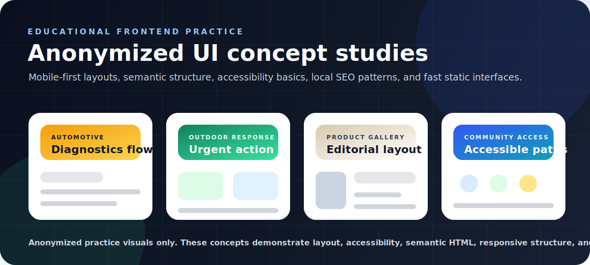

# Hello, I am Dean.

I’m an Entry-Level Developer focused on IT automation, cloud operations, and building practical tools for support teams. I like building things that actually solve problems—like automating repetitive checks, tracking cloud costs, and building dashboards so teams can see what's going on. Most of my projects sit right between IT support and engineering, using tools like React, FastAPI, and Docker. I'm currently working hard to break into the IT industry full-time, so I spend my time teaching myself modern cloud skills and building projects that prove I can do the work.

## Current Focus
*   **Engineering Hardening:** Adding database constraints, Firestore rule validation, webhook timeouts, and regression tests around failure modes.
*   **CI/CD Pipeline Automation:** Keeping GitHub Actions builds, tests, Terraform validation, and blocking image security scans green on `main`.
*   **Production Readiness:** Documenting problems faced, fixes shipped, and remaining extension paths so each repository is reviewable without guesswork.

## Start Here

| Project | Why It Matters | Stack | Proof |
| --- | --- | --- | --- |
| [Digital Ops Con Ed Refresh](https://github.com/stokie2605/digital-ops-con-ed-refresh) | Commercial digital strategy, website messaging, and UX refresh delivered for a real-world IT support provider. | Digital Strategy, UX, Copywriting | Commercial Project |
| [StaffRota](https://github.com/stokie2605/staff-rota) | Full-stack shift and rota management system with database-enforced double-booking protection. | Python, FastAPI, React, SQLite, Docker | `pytest` + DB constraint + CI |
| [Cloud Cost Guardian](https://github.com/stokie2605/cloud-cost-guardian) | AWS FinOps scanner for idle EBS volumes and Elastic IP waste, with dashboard evidence. | Python, boto3, Docker, React, GitHub Actions | [Live demo](https://cloud-cost-guardian-ten.vercel.app) & `pytest + CI/CD` |
| [Cloud-Native Task Automator](https://github.com/stokie2605/cloud-native-task-automator) | Scheduled ECS/Fargate task pattern with private AWS service endpoints and blocking image security scans. | Python, Docker, Terraform, GitHub Actions | `pytest` + Terraform + blocking Trivy gate |
| [Uptime Ping Monitor](https://github.com/stokie2605/uptime-ping-monitor) | Infrastructure monitoring dashboard for uptime checks, outage states, recovery actions, and logs. | React, Vite, JavaScript | [Live demo](https://uptime-ping-monitor.vercel.app) & `Node test + CI` |
| [Save Our Supper](https://github.com/stokie2605/save-our-supper) | Firebase-backed foodbank referral workflow with hardened Firestore rules, role gates, and privacy-safe public tracking. | React, TypeScript, Firebase | [Live app](https://save-our-supper.web.app/) & `Vitest + CI` |

## Frontend & UI Design Concepts (Mobile-First)

Alongside my IT automation and cloud projects, I have been building anonymized local-service-style frontend concepts to practise mobile-first layouts, semantic HTML, accessibility, local SEO structure, fast static pages, and polished interface composition. These are educational portfolio concepts, not client work.

| Concept Category | Technical Focus |
| --- | --- |
| **Automotive Diagnostics Interface** | Dark service-flow concept focused on compact information hierarchy, mobile navigation, tap-friendly actions, and fast feedback states. |
| **Outdoor Response Interface** | High-contrast utility concept focused on theme persistence, urgent action placement, responsive imagery, and readable contrast. |
| **Bespoke Product Gallery Interface** | Minimal editorial concept exploring visual hierarchy, whitespace, typography pairing, gallery pacing, and premium product presentation. |
| **Community Access Interface** | Accessible information-flow concept focused on semantic HTML, keyboard-friendly navigation, readable content structure, and a11y-conscious design. |

## Production Hardening Pass

Recent engineering hardening focused on failure modes that simple demo apps often miss:

| Area | Improvement |
| --- | --- |
| Data integrity | `save-our-supper` now validates live order structure in Firestore rules and blocks spoofed ownership fields. |
| Concurrency | `staff-rota` now uses a database uniqueness constraint and `409 Conflict` handling for double-booking races. |
| Runtime resilience | `msp-alert-bridge` now aborts hung outbound webhook calls after 5 seconds. |
| Cloud networking | `cloud-native-task-automator` now includes private AWS service endpoints for ECR, S3, and CloudWatch Logs. |
| CI/CD security | `cloud-native-task-automator` now fails builds on `HIGH` and `CRITICAL` Trivy image findings. |
| Automated Testing | `it-asset-db-api` now features a `pytest` suite simulating CRUD operations against a patched mock database configuration. |
| Mocking & Verification | `it-support-automation` now has unit tests mocking system disk usage and platform specs to verify automated PC cleanup logs. |

## Core Toolkit

| Area | Tools and Workflows |
| --- | --- |
| Languages | Python, JavaScript, TypeScript, PowerShell, SQL |
| Cloud and DevOps | Docker, Docker Compose, GitHub Actions, Terraform, AWS automation patterns, Firebase Hosting, Vercel |
| Infrastructure Automation | ECS/Fargate task patterns, EventBridge scheduling, IAM least privilege, logging, Trivy scanning |
| Frontend | React, Vite, responsive operational dashboards |
| Backend and Data | Python pipelines, Node.js, Firebase, Supabase, SQLite, JSON APIs |
| IT Automation | CLI tools, workstation health checks, report generation, webhook payloads, structured logs |

## Supporting Projects

| Project | Purpose | Stack |
| --- | --- | --- |
| [PowerShell IT Automation](https://github.com/stokie2605/powershell-it-automation) | Windows workstation setup, disk checks, cleanup simulation, and operational logging. | PowerShell, syntax validation CI |
| [Developer News Signal Pipeline](https://github.com/stokie2605/developer-news-signal-pipeline) | API-based backend data pipeline that collects Hacker News stories, normalises records, scores developer relevance, and stores SQLite, JSON, and HTML snapshots. | Python, SQLite, pytest, GitHub Actions |
| [User Provisioning Simulator](https://github.com/stokie2605/user-provisioning-simulator) | Models IAM onboarding logic for usernames, corporate emails, temporary credentials, and groups. | React, Vite, `Node test + CI` |
| [MSP Alert Bridge](https://github.com/stokie2605/msp-alert-bridge) | Normalizes MSP alert payloads with shared-secret checks and timeout-guarded webhook forwarding. | TypeScript, Node.js, `Node test + CI` |
| [IT Ticket Dashboard](https://github.com/stokie2605/it-ticket-dashboard) | Service desk dashboard for logging, triaging, resolving, and reviewing IT incidents. | React, Vite, Supabase |
| [IT Asset DB API](https://github.com/stokie2605/it-asset-db-api) | FastAPI REST backend for IT asset tracking. | Python, FastAPI, SQLite, Docker, pytest CI |
| [IT Asset DB Frontend](https://github.com/stokie2605/it-asset-db-frontend) | Full-stack React dashboard that consumes the Asset API. | React, Vite, CSS |
| [IT Support Automation](https://github.com/stokie2605/it-support-automation) | Windows workstation health checks, disk checks, cleanup simulation, and operational logging. | Python, pytest CI |

## How I Build

I try to make each project reviewable without guesswork: clear problem statement, visible stack, screenshots or live demos where useful, exact run commands, CI/CD checks where appropriate, and notes about what would be needed for production.

The common thread is practical operational value: fewer repetitive checks, clearer evidence, better infrastructure visibility, and cleaner handover between IT support, DevOps, and engineering teams.

## Portfolio Log

Recent cross-repo polish is tracked in [PORTFOLIO_CHANGELOG.md](PORTFOLIO_CHANGELOG.md).
