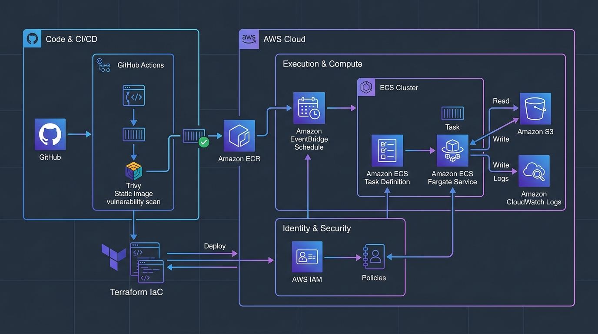
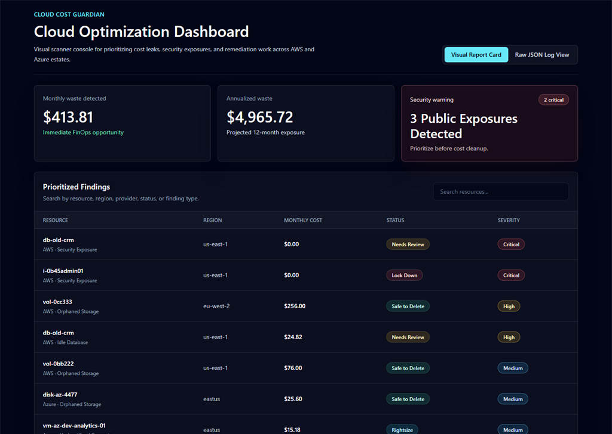
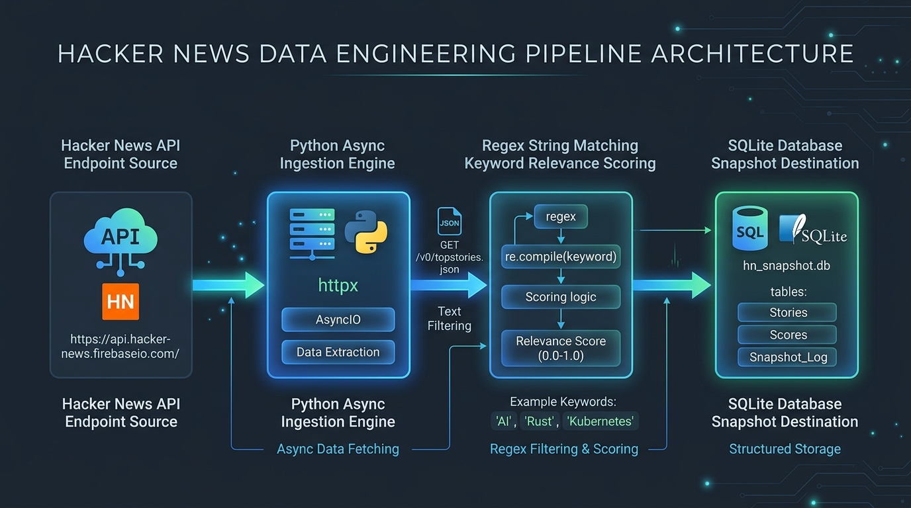

# Hi, I'm Dean (@stokie2605) 🛠️

I have a strong background working on the ground in industrial and warehouse operations. Since early 2025, I have translated that real-world operational experience into building reliable IT workflows, automating routine system administration tasks, and eliminating manual helpdesk bottlenecks.

My absolute strength and focus is on the backbone systems: writing Python and PowerShell scripts to automate administrative tasks, working with SQL databases, containerizing configs with Docker, and leveraging AWS to keep infrastructure running smoothly and securely. 

I am looking to bring this practical, automated approach to hands-on roles like **Systems Administration, IT Support Operations, Cloud Infrastructure, or technical Helpdesk engineering**—where I can use my scripting and operations skills to keep environments stable.

📫 **Reach out:** stokie2605@gmail.com | 🕒 **Timezone:** UTC (UK)

---

## 💻 Selected Engineering Projects

### 1. School IT Support — Service Catalog & SLA Workflow Architecture
An operational framework and messaging architecture designed to streamline IT helpdesk workflows, standardize support requests, and improve service delivery.
*   **Tech Stack:** `ITIL Framework`, `SLA Optimization`, `Workflow Mapping`
*   **Deliverables:** Incident decision trees for common school IT failures, escalation path structures, and clear, non-technical support catalog templates.

---

### 2. PowerShell IT Automation Suite
A suite of robust PowerShell scripts built for systems administration, automating repetitive Windows operational tasks, data extraction, and bulk endpoint management workflows.
*   **Tech Stack:** `PowerShell`, `CIM / WMI`, `Pester (Testing)`
*   **Deliverables:** Automated local workspace directory provisioning, hardware audits, and network interface diagnostic loops.

---

### 3. Cloud-Native Task Automator
A secure Infrastructure-as-Code (IaC) deployment pipeline automating containerized task execution under AWS ECS/Fargate using Terraform. Integrates automated security scanning gates to block vulnerable deployments.
*   **Tech Stack:** `Terraform (HCL)`, `AWS (ECS/Fargate)`, `Docker`, `GitHub Actions`, `Trivy`
*   **Deliverables:** Automated task runners, infrastructure drift detection, and secure container scanning configurations.

---

### 4. IT Ticket Dashboard
An operational service desk ticket system designed to streamline IT support workflows, enforce row-level security, and monitor support ticket response times.
*   **Tech Stack:** `PostgreSQL`, `PostgREST API`, `Tailwind CSS`, `Operational UI`
*   **Deliverables:** Helpdesk ticket routing rules, automated priority escalations, and PostgreSQL security policies.

---

### 5. Cloud Cost Guardian
An automated AWS resource cost-compliance utility that scans infrastructure, identifies unattached EBS volumes and idle Elastic IPs, and flags wasted cloud spend.
*   **Tech Stack:** `Python (Boto3 SDK)`, `AWS CLI`, `FinOps Governance`
*   **Deliverables:** Cloud cost reporting audits, drift detection metrics, and automated resource cleanup scripts.

---

### 6. Developer News Signal Pipeline
An unattended cron data-ingestion pipeline written in Python that polls, filters, and normalizes news sources, using SQLite transactions to ensure reliable local archiving.
*   **Tech Stack:** `Python`, `SQLite Database`, `Scheduled Automations`
*   **Deliverables:** Safe database transaction handling, scheduled data fetching, and local SQLite data snapshots.

---

## 🛠️ Unified Tech Stack

*   **Languages & Scripting:** PowerShell, Python, Bash, SQL, TypeScript/JavaScript
*   **Cloud & DevSecOps:** AWS (EC2, ECS/Fargate, IAM, Boto3), Terraform (IaC), Docker, GitHub Actions, Trivy
*   **Systems & Databases:** Windows Server Administration, PostgreSQL, SQLite, Firestore
*   **ITSM & Support:** ITIL Service Cataloging, SLA Workflow Design, Incident Alert Routing

---

## 📈 Recent Technical Upgrades
*   **Structural Hygiene:** Standardized configuration files and organized scripting utilities across key repository structures for cleaner execution.
*   **Security Controls:** Hardened repository configurations, structured environments to safeguard operational credentials, and enforced secure API query limits.
*   **Data Integrity:** Refactored data handling logic to enforce strict transaction validation, clean database schema migrations, and optimized resource caching.
*   **Code Quality:** Cleaned out orphaned script assets, automated syntax checking, and introduced structured testing targets for deployment verification.

*Feel free to explore my repositories to see how I build and deploy these automation tools.*
