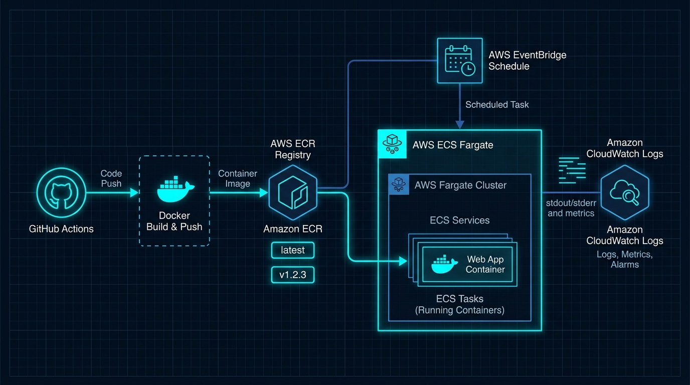
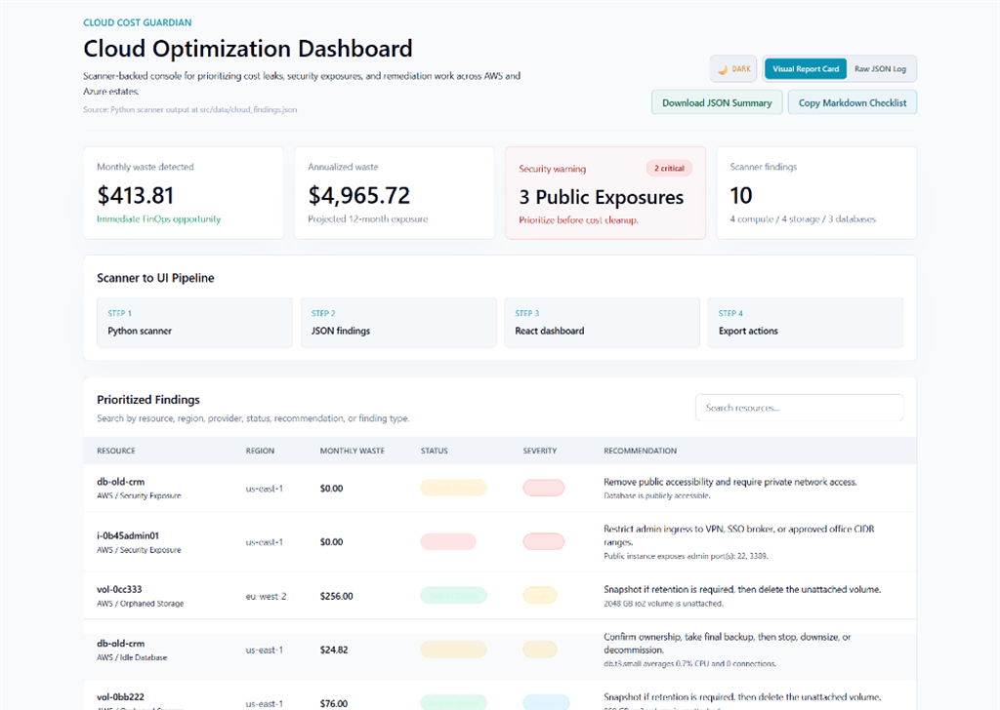
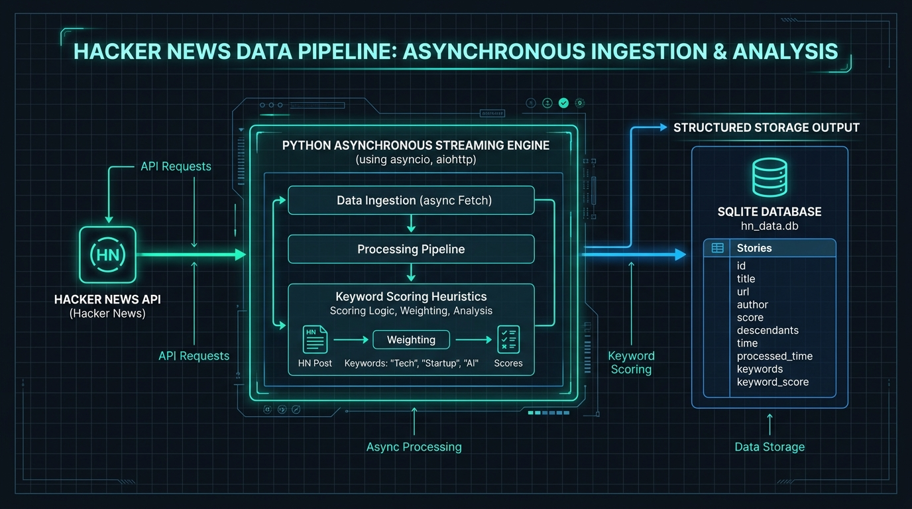

# Dean Wilshaw (@stokie2605)
### **IT Operations, Systems Administration & Automation Specialist**
📫 **Contact:** [stokie2605@gmail.com](mailto:stokie2605@gmail.com)

---

I bridge the gap between physical operations and digital infrastructure. With a strong operational background, I specialize in eliminating helpdesk bottlenecks, automating routine system administration tasks, and building reliable, self-healing IT workflows.

### 🛠️ Core Technical Competencies
* **Systems Administration & Automation:** PowerShell, Python, Bash scripting, Windows Server Administration, Endpoint Diagnostics
* **Cloud & Infrastructure Governance:** AWS (EC2, FinOps Cost Optimization, Resource Governance), Docker, Terraform (IaC)
* **ITSM & Operational Workflows:** ITIL Service Catalog Design, SLA Tracking, Hardware Lifecycle Inventory Control, Automated Alert Routing

### 🚀 Operational Philosophy
I build tools to solve real-world operational problems. Whether it is writing a PowerShell script to automate endpoint maintenance, configuring a middleware bridge to reduce helpdesk alert fatigue, or auditing cloud environments for wasted spend, my focus is always on **high availability, clean documentation, and practical problem-solving.**

---

## 💻 Selected Engineering Projects

### 1. [School IT Support — Service Catalog & SLA Workflow Architecture](https://github.com/stokie2605/school-it-support-refresh)
ITIL Service Catalog Design and SLA Communication mapping. Translates complex operational metrics (SLAs, MTTR) into plain-English value propositions and structured service levels for non-technical managers.

* **Tech Stack:** HTML5, Tailwind CSS, B2B User-Journey Heuristics, ITIL SLA Frameworks
* **Deliverables:** Operational service catalog schemas, search-optimized SLA pathways, and B2B user-journey layouts.

  

---

### 2. [PowerShell IT Automation Suite](https://github.com/stokie2605/powershell-it-automation)
A modular suite of robust systems administration scripts utilizing native WMI/CIM cmdlets to audit hardware metrics, verify disk health parameters, and export timestamped endpoint diagnostics.

* **Tech Stack:** PowerShell, WMI/CIM Cmdlets, Pester (Unit Testing)
* **Deliverables:** Automated local workspace directory provisioning, hardware audits, and network interface diagnostic loops.

  

---

### 3. [Cloud-Native Task Automator](https://github.com/stokie2605/cloud-native-task-automator)
An Infrastructure-as-Code (IaC) continuous deployment pipeline automating containerized task execution on AWS ECS/Fargate cluster environments, secured by Trivy vulnerability gates.

* **Tech Stack:** Terraform (IaC), AWS ECS/Fargate, Docker, GitHub Actions, Trivy
* **Deliverables:** Reproducible Terraform configs, automated task definition runners, and security linting gates.

  

---

### 4. [Cloud Cost Guardian](https://github.com/stokie2605/cloud-cost-guardian)
An AWS FinOps automation scanner utilizing the Boto3 SDK to query cloud assets for cost leakage, orphaned EBS volumes, and unassociated Elastic IPs.

* **Tech Stack:** Python (Boto3 SDK), AWS CLI, FinOps Governance, React (Operations Console)
* **Deliverables:** Cloud cost reporting audits, drift detection metrics, and automated resource cleanup scripts.

   

---

### 5. [Developer News Signal Pipeline](https://github.com/stokie2605/developer-news-signal-pipeline)
An unattended, cron-scheduled data-ingestion pipeline written in Python. Handles API endpoints, parsing data, and committing relational updates safely inside a transactional SQLite database.

* **Tech Stack:** Python, SQLite, Cron Automations, pytest
* **Deliverables:** Safe database transaction handling, scheduled data fetching, and local SQLite data snapshots.

  

---

### 6. [RotaCare (staff-rota)](https://github.com/stokie2605/staff-rota)
A full-stack, industry-agnostic healthcare staff scheduling platform designed to streamline shift management, track staff hours, and manage absences seamlessly.

* **Tech Stack:** React 18, Vite, FastAPI, SQLModel, SQLite
* **Deliverables:** Interactive Gantt Rota with drag-and-drop, real-time absence conflict detection, full database persistence with optimistic UI offline fallbacks.

  

---

### 7. [Client Mockups & Local Business Web Designs](https://github.com/stokie2605/client-mockups)
An anonymous, mobile-first portfolio showcasing high-converting UI/UX designs built for local business niches (HVAC, IT Support, Accounting, Scaffolding, Telecoms).

* **Tech Stack:** HTML5, Tailwind CSS, Responsive Design, GitHub Pages
* **Deliverables:** Reusable component library, automated local git deployment workflow, multi-client showcase gallery.

<table align="center">
  <tr>
    <td align="center"></td>
    <td align="center"></td>
  </tr>
  <tr>
    <td align="center"></td>
    <td align="center"></td>
  </tr>
  <tr>
    <td align="center"></td>
    <td align="center"></td>
  </tr>
  <tr>
    <td align="center"></td>
    <td align="center"></td>
  </tr>
</table>

---

## 🛠️ Unified Tech Stack

* **Languages & Scripting:** PowerShell, Python, Bash, SQL, TypeScript/JavaScript
* **Cloud & DevSecOps:** AWS (EC2, ECS/Fargate, IAM, Boto3), Terraform (IaC), Docker, GitHub Actions, Trivy
* **Systems & Databases:** Windows Server Administration, PostgreSQL, SQLite, Firestore
* **ITSM & Support:** ITIL Service Cataloging, SLA Workflow Design, Incident Alert Routing

*Feel free to explore my repositories to see how I build and deploy these automation tools.*

---

## Recent Architectural Upgrades
* **Operational Restructuring:** Standardized repository file hierarchies by separating core automation logic, helper scripts, and test files.
* **Security Hardening:** Swapped legacy credential configs for environment variables and secure token validation policies.
* **Database Schema Upgrades:** Refactored primitive database types into native data structures for robust ORM and transaction handling.
* **Systems Maintenance:** Eradicated legacy diagnostic scripts, optimized loops, and established static analysis scanning to ensure code hygiene.
